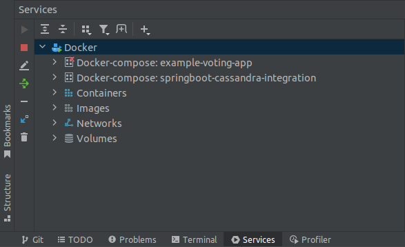
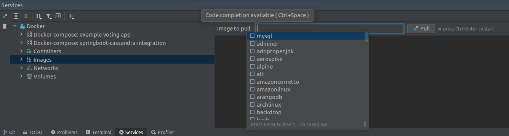
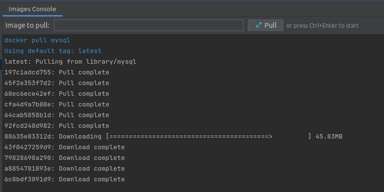
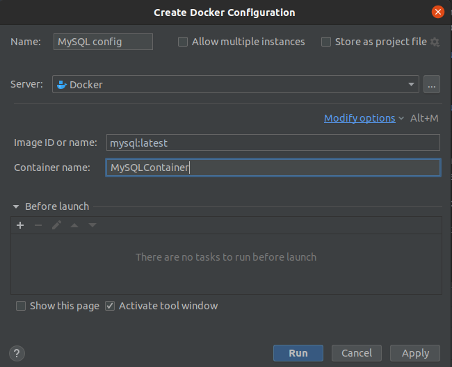
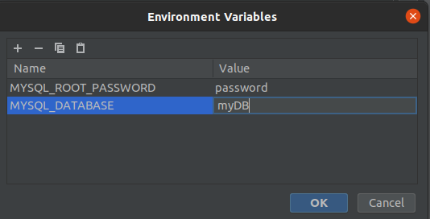
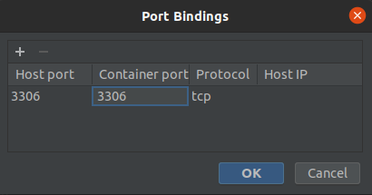
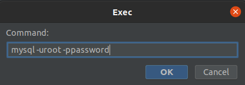
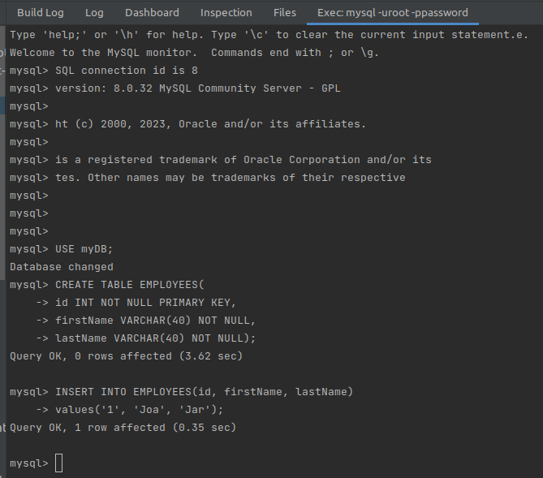
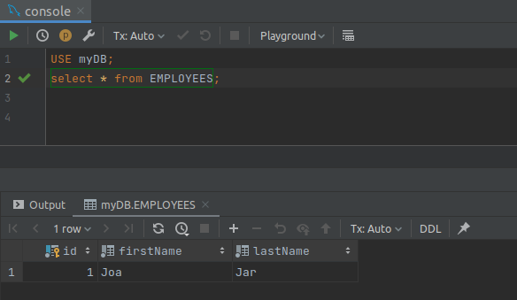

# Hello(ł) Mongo(ł) on Docker

Below I put some notes from my learning Mongo DB process.
Subsequent stages of work are documented in <strong>reverse chronological order</strong> below
and by means of branches with appropriate numbers in its names.
---
(2) https://www.youtube.com/watch?v=ck6xQqSOlpw

How to use dockers in IntelliJ? 
After connecting Docker with IntelliJ, see all containers and images in the Services tab:
 
 
To choose (from a list available in DockerHub) an image to pull: Images -> Ctrl+Space to see images list:
 
 
To pull chosen image: Ctrl+Enter:
 
 
After pulling, we will see it at the Images tab. To create a container,
**right** click on an image and create its config:
 
 
Click **Modify options** and enable **environmental options** 
to pass (obligatory for MySQL DB) a root password in root password environment variable,
and specify MYSQL_DATABASE variable to create a DB when container starts:                                                                                                                                                                                                                                                                                                                                                                                                                                                                                                                                                                                                                                                                                                                                                                                                                                                                                                                                                                                                                                                                                                                                                                                                                                                                                                                                                                                                                                                                                                                                                                                                                                                                                                                                                                                                                                                                                                                                                                                                                                                                                                                                                                                                                                                                                                                                                                                                                                            :
 
 
In **Modify options**, use **Bind ports** to specify ports for using DB outside the container:
 
 
Click **run** to create a container. After having it up and running, **right** click on a container
and choose **Exec** to run commands. Next choose **Create and Run**, pass the user and its password 
and click OK:
 
 
Create a sample table:
 
 
Next, using the Database tab in IntelliJ, connect with DB using the following config:
 
 
Read data from a sample table:
 
 
And that's all Folks ;-)
---

(1) https://www.youtube.com/watch?v=FzwIs2jMESM

At first, build possibly the simplest Java app without installing Java but by means of Docker.

To build a docker image defined in Dockerfile, you need to run in your terminal the command as below.
The dot means the location of Dockerfile (its path):
`docker build -t hello-docker:1.0 .`

To see the list of local Docker images, run:
`docker images`

To instantiate created Docker image, i.e. create a Docker container, and run it, run:
`docker run hello-docker:1.0`

To see all running and stopped containers (our container hello-docker:1.0 is stopped immediately after its creation), run:
`docker ps -a`

Attention: to avoid java.lang.UnsupportedClassVersionError, carefully choose appropriate
Java version (e.g. by sdk) and SDK at Project Settings -> Project in Intellij IDEA.